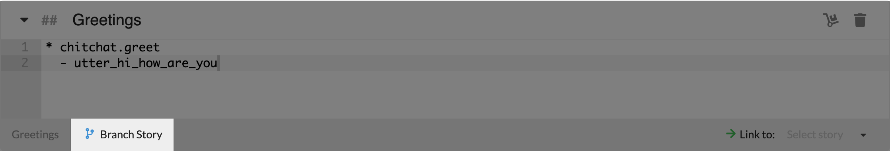
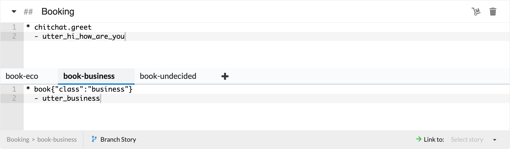
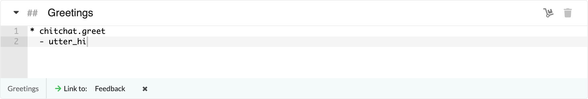
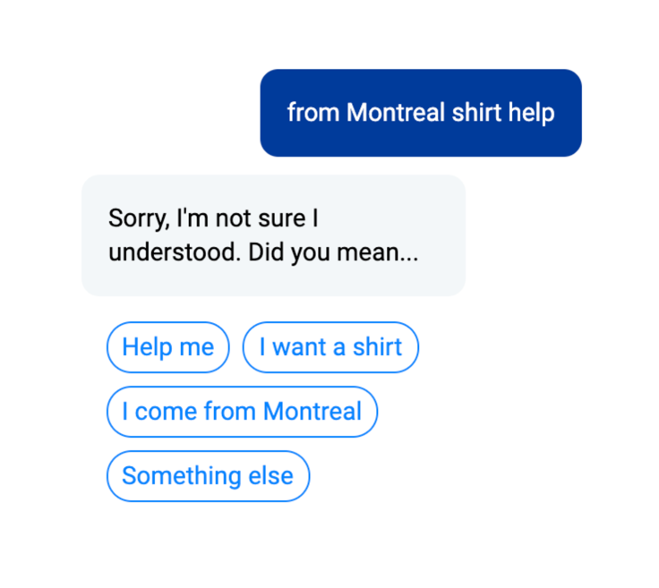
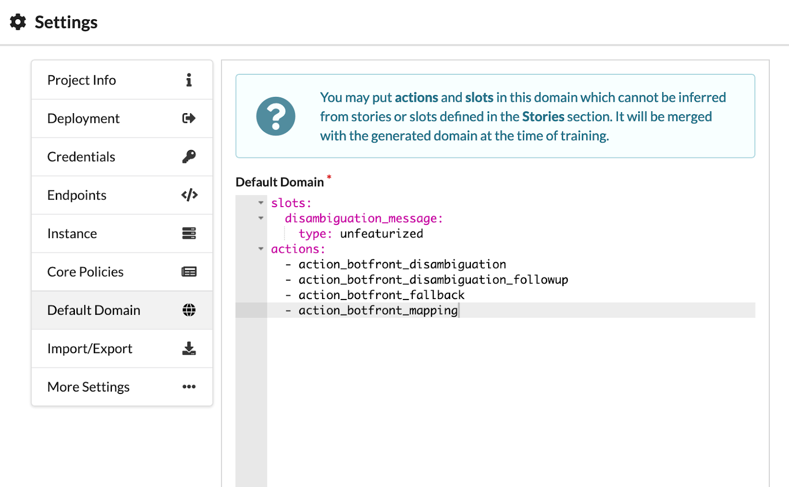
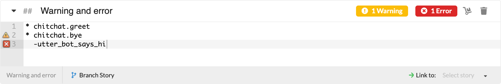
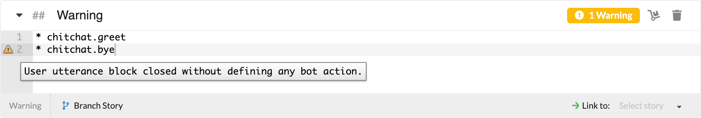
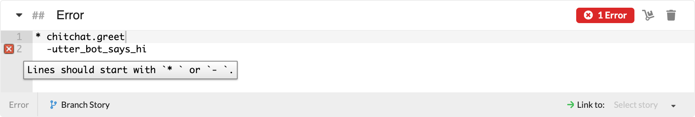

- **Branching and linking:** Stories now include the options to branch them and also link them to other stories.
- **Disambiguation policy:** You can now implement a disambiguation process where buttons corresponding to the top-ranking intents are displayed to the user.
- **Default domain management:** You can now declare custom actions or slots in the default domain.
- **Warnings and errors: Warnings** and errors are now clearly visible on the story editor - both on the lines where they are flagged and on the story header.

# 🔗 Branching and Linking

Previously, you had to create too many stories to be able to address complex conversational flows. This brought problems because conversations are often designed as tree-like flowcharts, and it is imperative that we have the ability to apply this organization to stories, which are essentially real conversation examples.  

In version 0.17, you just click Branch Story and that’s it!  

  

You may branch as many times as you want and add as many tabs as you want to any level.  

  

Branches can be renamed which makes it much easier to follow flows within the story. Head to our [documentation](/docs/rasa/stories/#branching-conversations) to see how you can effectively use branching.  

**Linking** is an additional feature on top of branching, where you can link any unbranched story or any end of a branched flow to another story. This becomes especially useful if you have some repeated flows, like your virtual assistant asking for feedback at the end of a conversation.  

  

Linking is explained in detail as well in our [documentation.](/docs/rasa/stories/#linking-stories)

# 🚀 New power feature: Disambiguation Policy

When your virtual assistant receives a user utterance, it calculates, for each intent in your domain, the confidence that the utterance is an instance of that intent. Sooner or later, your virtual assistant will be faced with utterances where none of the calculated confidences are particularly high. It’s very often best to treat those cases separately, since it may mean that your bot does not understand, or is unsure.  

  

Within the Rasa framework, this is done using [policies](https://rasa.com/docs/rasa/core/policies/). The Botfront Disambiguation Policy implements a disambiguation process where buttons corresponding to the top-ranking intents are displayed to the user. [Check out our docs](/docs/rasa/stories/#disambiguation-user-input) to see how you can adjust and use the disambiguation policy.  

# ⚙︎ Default Domain Management

  

An important part of developing and maintaining a Rasa virtual assistant is keeping [domain files](https://rasa.com/docs/rasa/core/domains/) up to date. Thankfully, Botfront makes this easier by automatically parsing the contents of your stories and extracting the different actions, entities, slots, etc. referenced within. However, it’s not always possible to infer everything that needs to go into the domain. For example, you might need to invoke a custom action, which in turn invokes another action, or makes use of a slot. This new release introduces a dedicated place in your project to declare such an action or slot, the Default Domain.

# ⚠️ ❌ Catch your errors on the fly!

Warnings and errors are now clearly visible on the story editor - both on the lines where they are flagged and on the story header. They guide you when you write your stories for them to work properly, and prevents training if there's an error that would affect the model and the chat experience.  

  

When there is a warning or an error, it is flagged on the corresponding line, and also indicated on the story header. When you hover over the icon, you get a suggestive explanation to resolve the issue.  

  

  
