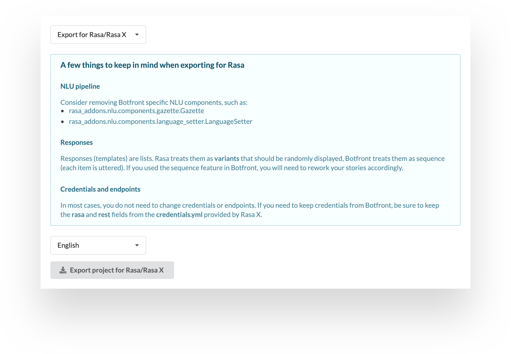

# Visual Conversation Builder

```
## Announcing Conversation Builder
* complaint.markdown_is_painful
  - utter_you_dont_need_it_anymore
  - utter_we_have_a_visual_editor
* chichat.🎉🥳
  - utter_happy_to_hear_that
```
<br />

Until today you had to create Rasa stories in Markdown and make explicit connections between stories, user utterances, and bot responses.<br /><br />

With the Botfront Conversation Builder, you can visually and naturally create conversational flows. Add user utterances, bot responses, use slots and actions in a sequential flow. <br /><br />You can also branch your conversations and link them to each other, or even to themselves in certain cases.<br /><br />

Botfront has become a fully intergrated Rasa UI for both NLU and stories.<br /><br />

The conversation builder also helps you annotating your data faster. When you type in a user utterance, it runs it through your existing trained model and annotates it accordingly. Then you can change the intent, create a new one, or highlight entities. When you click Save, the utterance is also be added to your training data. This is a great way to kickstart your NLU model at the early stages of your project.<br /><br />

Another benefit of building conversational flows visually is that you can take better decisions on guiding the scenarios. Having the ability to see conversational elements with their actual content lets you envision the whole tree better, and you can pinpoint areas of improvement.<br /><br />

We have extensively explained how to use the new conversation builder in our [documentation](/docs/rasa/conversation-builder/). We have also provided a [sample flow](/docs/rasa/conversation-flows/) that goes over best practices in stories and shows how you can effectively use branching and linking.<br /><br />

For Markdown lovers, we have kept it available and you can always toggle between both views, whichever is more convenient for you.<br /><br />

# Export for Rasa/Rasa X

<br /><br />

We have added the ability to export your Botfront projects in a compatible format with Rasa/Rasa X. When you export (in settings), you will receive a zip file containing all the files required to initiate a Rasa X project. You can get more detailed information on the feature from our [documentation](/docs/import-export/).<br /><br />

Hold on tight, import for Rasa/Rasa X is almost here! You will be able to easily continue and improve your Rasa project utilizing all the features and visual aspects of Botfront.<br /><br />
