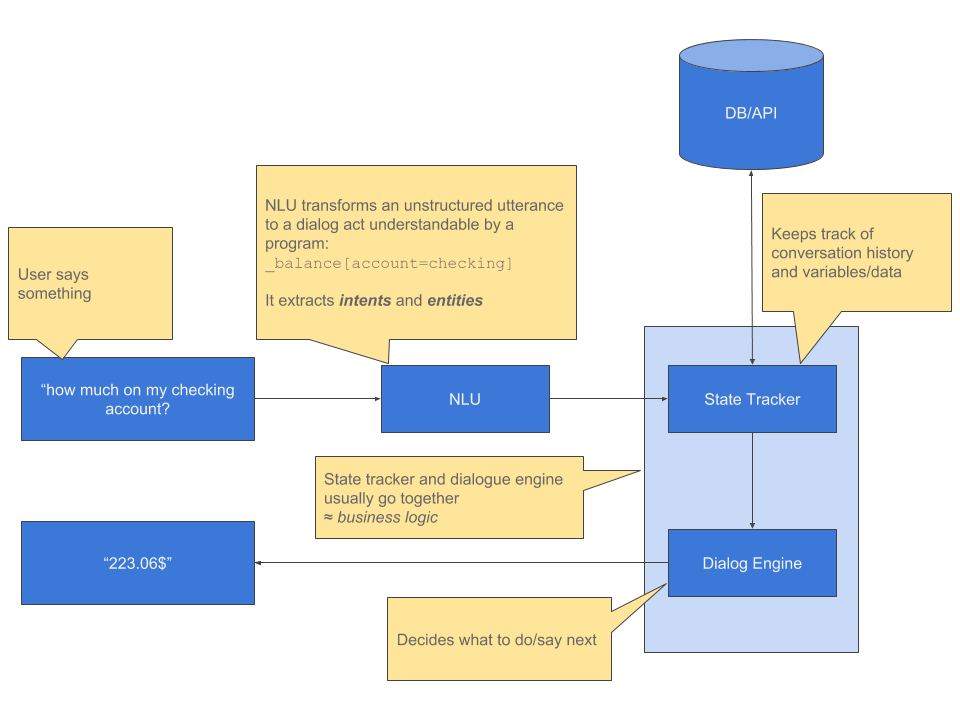
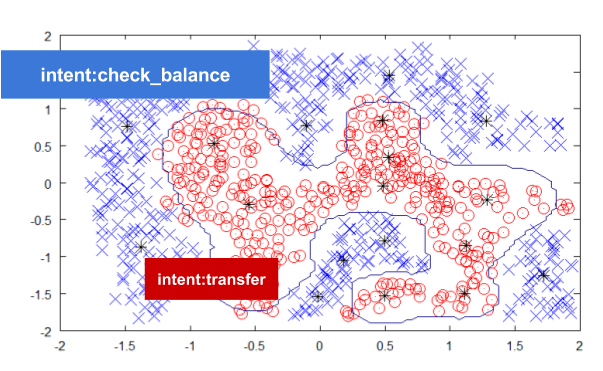

If you’re building a Chatbot, you are probably using a Natural Language Understanding system to get intents and entities from utterances. Popular NLU Saas include DialogFlow from Google, LUIS from Microsoft, or Wit from Facebook. Getting the NLU part right is key to a successful conversational experience. This post explains how intent classification works. 
\
If you’re building a Chatbot, you are probably using a Natural Language Understanding system to get intents and entities from utterances. Popular NLU Saas include DialogFlow from Google, LUIS from Microsoft, or Wit from Facebook. Or you can use the open-source Rasa NLU if you want more control and flexibility. If you think about it, or look at the diagram below, getting the NLU part right is key to a successful conversational experience. If you can’t understand a user, your bot will siphon away whatever effort you put in other components such as dialogue management. Part of getting NLU right is understanding how it works, how such a system can capture the underlying meaning of a sentence and map it to an intent. That is what this post is about.

# Task-oriented chatbot anatomy

An intent is a group of utterances with similar meaning
Meaning is the important word here. Consider these two sentences: “I want to make a reservation in an Italian restaurant” and “I need a table in a pizzeria”. They both mean the same thing (even if all Italian restaurants are not pizzerias) but all the words are different. How can our NLU determine they are similar and assign them both the intent book? 

Pattern matching won’t work here since the words are different. We need something smarter, an NLU system must understand the meaning of sentences.

# Teaching semantics to a Martian
Imagine you’re a Martian, you can read but know nothing about words. Just after you land on our planet you find these sentences written on a stone: 

> “I’m sitting on a bench with my friend.” 
> “It rains on the bench we used to sit on.” 
> “You can sit either on the chair or on the bench.” 
> “Laurie is sitting on a chair.” 
> “Hi, welcome, please sit on the chair.” 
> “That’s the chair your grandfather used to sit on.” 

You might figure out that a chair or a bench is something you sit on and sit is something you do with chairs and benches. In other words, words appearing in the same context share semantic meaning.  

Of course, you won’t understand what chair or sit means, but that’s ok. We’re interested in finding similarities, so knowing that a chair is similar to a bench is already something.  

Now, if you spend the next 2000 years reading all of Wikipedia, you will be able to find many more similarities. You will have read about all sorts of foods, chemicals, cities, professions, skills, and many other subjects so you’ll be able to say that “teacher” is somewhat more similar to “professor” than a “physicist”. That an “apple” is more similar to an “orange” than a ‘hamburger’.  

Do you get the idea? Now that we taught semantics to Martians, can we do the same with a computer?

# Teaching semantics to a machine
NLU is about machine learning; machine learning is about statistics, and statistics are about numbers. So how can we turn “apple” is more similar to an “orange” than to a ‘hamburger’ into a comparison with numbers? The answer is word vectors.  

Forget the Martian. Algorithms such as Word2Vec or Glove are used to train a model from huge text corpora such as Wikipedia or Commoncrawl. Training means the algorithm reads the entirety of Wikipedia and learns words and semantics from their context. The output of this training is word vectors. Each word is a vector (an array of numbers). As you remember from vectors, you can place them in a space and measure the distance between them. Similar words will have vectors close to each other. The distance between the vectors of “apple” and “orange” is smaller than between the vectors of “apple” and “hamburger”.  

The video below explores a 3-D projection of a 200-D word vectors space. We can easily visualize how similar words are clustered together. I made this video with http://projector.tensorflow.org/. Feel free to explore it by yourself 🙂  

`youtube:https://www.youtube.com/embed/m14YgNMf3og`

  
If you’re interested in reading more about these techniques I recommend this great article from the Morning Paper blog.  

Word vectors are  good for comparing words, but how do we compare sentences? Simple. You can perform arithmetic operations on vectors. A sentence is a group of words. Each word has a vector, so why don’t we just sum them up? Because long sentences would make vectors with higher values: “I really really really need to eat something right now” and “I am hungry” wouldn’t be similar anymore. That’s why they are generally averaged. It generally works, even if some constructs such as negation can pose problems.  

To recap, the meaning of a word is captured by its word vector, and the meaning of a sentence is captured by the average of the vectors of its words. So now we have something that can enable a machine to say “I am hungry” and “I want to eat” are similar sentences.  

We could leave it here, have one sentence per intent and when a user utters something, compute the vector and look for the closest sentence. But it wouldn’t work well. Sometimes, to explain something, you need to repeat, rephrase, and give several examples to be understood.  

# Train a model with more examples
NLU systems become better with more training. That’s why they need several examples for every intent. Those examples should be similar in meanings, so if you were to plot all those sentences’ vectors, they should be close to each other. The examples should form sort of clouds of points (one cloud for each intent). When you train your NLU, it learns the boundaries between all the clouds, so when your system encounters a sentence it has never heard it can map it to the closest cloud of points and determine its intent. The illustration below shows how such clouds and boundaries might look. Each point corresponds to a sentence, or more precisely to a sentence’s vector. Blue crosses are vectors of sentences with the intent check_balance, and red circles correspond to vectors of sentences with the intent transfer.  

# Does it really work like that?
I obviously don’t know about LUIS, Dialogflow or Wit internals. Rasa works by using word vectors, but also has other featurizers available. Word vectors are very powerful and it is reasonable to assume those services use them among other features. If you are familiar with Wit.ai, it uses trait as one type of entities. I am guessing those are powered by vectors.

# Conclusion and take-away
You’re probably wondering how to use this knowledge in your projects. If you’re using a Saas, you can use it to figure out why something is not working.

## Negations
> “I am hungry” vs. “I am not hungry”

Negations are tricky when averaging the value of word vectors because the word “not”  wouldn’t drastically change the meaning of a sentence. An NLU system only using vectors as features won’t handle that well. 

## Words in a non-mainstream context
Suppose you are building a finance bot. Your users might use words such as “blue chip stock” or “bull market”. Remember word vectors are trained on Wikipedia or Commoncrawl, where words are found in their mainstream context. Therefore it’s unlikely “blue chip stock” and “Apple” will be seen as similar, but “bull market” and “farmers market” will likely be considered to be similar. This might impact how your system classifies examples.

## Specific vocabulary
> “bk ✈️ 2 SFO”

bk might be the abbreviation of many words (book, back, bike,…), so a Saas cannot know what your user means. Emojis might not work well either. Again it depends on how the NLU works, but standard word vectors won’t get the meaning of half of the sentence. 

Knowing how a NLU system works allows you to understand some problems you might encounter. But how can you solve them? My solution is getting off Saas and using software I can control. Rasa is great for that. In an upcoming post, I’ll show you how you can address some of the problems mentioned above by going under the hood. 

